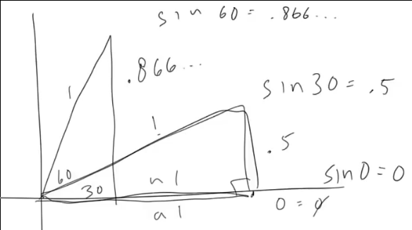

[Coding Math: Episode 2 - Intro to Trigonometry](https://www.youtube.com/watch?v=yAHl_kpqr-k)

[CanvasRenderingContext2D.translate()](https://developer.mozilla.org/en-US/docs/Web/API/CanvasRenderingContext2D/translate)

[CanvasRenderingContext2D.lineTo()](https://developer.mozilla.org/en-US/docs/Web/API/CanvasRenderingContext2D/lineTo)

[HTML5 Canvas - Drawing Lines](https://www.tutorialspoint.com/html5/canvas_drawing_lines.htm)





[logogoful 4 years ago](https://www.youtube.com/watch?v=yAHl_kpqr-k&lc=Ugi9TWh3zDMNeHgCoAEC)

```
1 degree  = pi * 1 radian / 180
1 radian = 180 * 1 degree / pi
```
[ThatOneGuy 2 months ago](https://www.youtube.com/watch?v=yAHl_kpqr-k&lc=Ugi9TWh3zDMNeHgCoAEC.855wJH0PH6097EmR9e4dZI)

```
Not really important, but i think it's good to know where "radian" pops up from.
Before that, you need to know what's known as "unit circle" which is just a circle with radius 1.
The motivation of radian is to find the angles such that the arc length of the unit circle is exactly equal to 1. Which can be found with arc length formula (with degrees) :
S = theta/360 . 2πr (if you dont know what this mean, it mean that arc length is just some fraction of that circle circumference)
We want the arc length to be exactly 1 so set S = 1, and r = 1 (because it's unit circle which have radius 1)
1 = theta/360 . 2π.1
Theta(in radian) = 180/π
```
