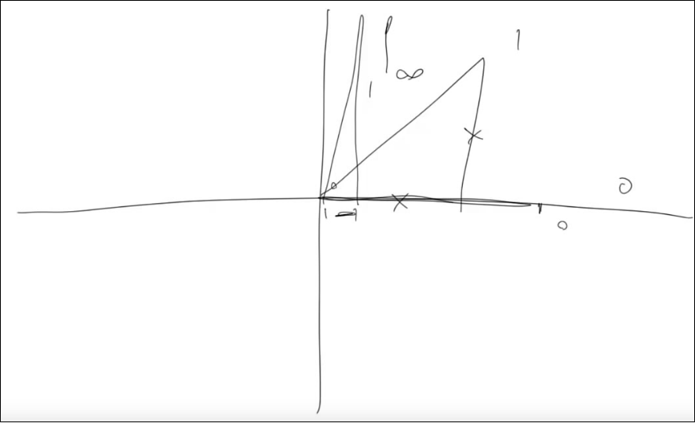

[Coding Math: Episode 3 - More Trigonometry](https://www.youtube.com/watch?v=-ayh6oEtjbA)

## Cosine

Rect triangle and coordinates system - various

Rect triangle and coordinates system - complete

Sine wave

Cosine wave

## Tangent

adjacent = 1, opposite = 0, tan0 = 0

adjacent = 1, opposite = 1, tan45 = 1

adjacent = very little, opposite = 1, tan~90 = ∞

adjacent = 0, opposite = 1, tan90 = undefined (1/0)

adjacent = very little, opposite = 1, tan~91 = -∞

adjacent = -1, opposite = 1, tan135 = -1

adjacent = -1, opposite = 0, tan180 = 0

adjacent = -1, opposite = -1, tan225 = 1

adjacent = very small, opposite = -1, tan270 = undefined

adjacent = 1, opposite = -1, tan315 = -1

Tangent wave

